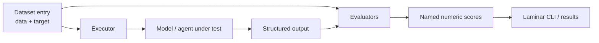
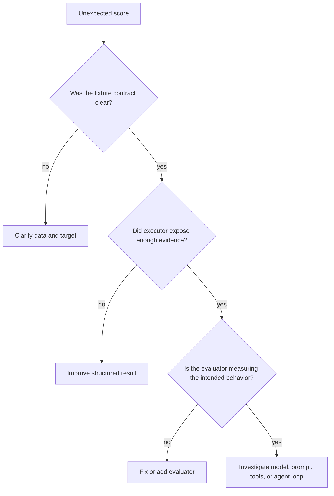

# Evals — Deep Dive

The files in `evals/` answer a question that ordinary TypeScript tests cannot
answer by themselves: **does the model-driven agent behave as intended when the
model is allowed to make decisions?**

An agent can compile, have every function unit-tested, and still choose the
wrong tool, call tools in the wrong order, or misread a tool result. An
**evaluation** (usually shortened to **eval**) runs representative scenarios
through the model and assigns each outcome a score. Over time, those scenarios
become a regression suite for the agent's behavior.

## Start here: the 60-second version

Think of an eval as a driving test for the agent. Instead of checking whether
individual parts of the car work, it checks whether the agent makes sensible
decisions in a realistic, controlled situation.

For every scenario, the suite does four simple things:

1. **Describe the situation.** A dataset entry supplies the user's request and
   the tools the agent is allowed to see.
2. **Run the agent safely.** An executor gives the model that scenario. In a
   multi-step test, tools return fixed mock results instead of touching the
   real machine.
3. **Keep the evidence.** The executor records the calls the agent made, their
   order, and its final answer.
4. **Score the behavior.** Evaluators compare that evidence with the hidden
   expectation and produce named scores from `0` to `1`.

In short:

```text
scenario → controlled agent run → evidence → scores
```

If you are new to this directory, read one scenario from left to right:

| Question | Start here | Then follow it to |
| --- | --- | --- |
| Did the model choose the right tool first? | `data/file-tools.json` | `file-tools.eval.ts` → `singleTurnExecutorWithMocks` → `toolSelectionScore` |
| Can the agent use tool results to finish a task? | `data/agent-multiturn.json` | `agent-multiturn.eval.ts` → `multiTurnWithMocks` → order, avoidance, and answer-quality evaluators |

The **target** is deliberately kept separate from the scenario. It is the
answer key for the scorer, not information that the model is allowed to see.
That separation is what makes the score meaningful.

### Choose your reading path

- **I only need to run an existing suite:** read this section, then jump to
  [Running the suites and current repository state](#8-running-the-suites-and-current-repository-state).
- **I need to understand a score that changed:** read the dataset first, then
  [Evaluators](#4-evaluators-translate-evidence-into-scores), then
  [How to read an eval result](#7-how-to-read-an-eval-result).
- **I need to add or change a scenario:** read Sections 2 through 5 in order.
  They explain the input, the controlled run, the scoring rule, and where the
  suite connects them.

This project uses Laminar's `evaluate` helper to run the suite, but the
architecture is framework-independent:



The three terms are deliberately different:

- An **eval** is the whole experiment: data, code that runs the system, code
  that grades it, and the resulting scores.
- An **executor** is the adapter that turns one eval input into one observable
  run of the system under test.
- An **evaluator** is a scoring function: it receives that observable output
  and the expected target, then returns a numeric score (normally `0` through
  `1`).

One useful way to remember the roles is: **data sets the challenge, the
executor observes the attempt, and the evaluator grades the attempt.**

The rest of this document walks through the current implementation in
`evals/executors.ts`, `evals/evaluators.ts`, `evals/*.eval.ts`, and
`evals/data/*.json`, explaining both the mechanics and why each boundary
exists.

---

## 1. Why evals are not ordinary unit tests

A normal unit test has a deterministic contract:

```ts
expect(add(2, 3)).toBe(5);
```

An LLM agent has a probabilistic decision in the middle of its behavior:

```text
user asks to inspect a file
        ↓
model decides whether readFile, listFiles, shell, or no tool is appropriate
        ↓
agent may need to interpret the returned content before answering
```

There are still plenty of valuable deterministic tests to write around an
agent—schema validation, tool implementations, message filtering, and context
compaction are all good examples. But they do not test the model's choices.
Evals fill that gap by testing **behavioral contracts**, such as:

- “For an explicit file-read request, choose `readFile`.”
- “For a general-knowledge question, do not reach for a file tool.”
- “To inspect a project, list its files before reading the entry point.”
- “Use a tool result to answer the user, rather than inventing an answer.”

Unlike a one-off manual prompt, an eval records the input, the expected
behavior, and a repeatable way to score it. That makes it useful before and
after changes to the system prompt, tool descriptions, model, SDK, or agent
loop.

### The right goal: a signal, not a proof

An eval score is evidence about a bounded set of cases, not proof that the
agent is safe or universally correct. A model can pass a tiny set of obvious
prompts and still fail on paraphrases, edge cases, or adversarial requests.
For that reason, a healthy eval suite grows from real failures and deliberately
includes both success cases and “do nothing” cases.

---

## 2. The shape of one dataset entry

The JSON files under `evals/data/` contain arrays of entries shaped like this:

```ts
{
  data: { /* what the executor receives */ },
  target: { /* what the evaluators receive */ },
  metadata: { /* human-facing description, optional */ },
}
```

Keeping `data` and `target` separate is more important than it first looks.
The executor needs only the information it is allowed to use to perform the
task. The target is the hidden answer key used for scoring after the run. If
the expected tool names were included in the prompt or executor input, the
model could effectively be told the answer.

`evals/types.ts` formalizes those shapes. It is a contract between static JSON
fixtures, executors, and evaluators—the same role an API request/response type
plays between a client and server.

### Single-turn data: `EvalData` and `EvalTarget`

```ts
interface EvalData {
  prompt: string;
  systemPrompt?: string;
  tools: string[];
  config?: { model?: string; temperature?: number };
}

interface EvalTarget {
  expectedTools?: string[];
  forbiddenTools?: string[];
  category: "golden" | "secondary" | "negative";
}
```

The single-turn fixture says, “given this prompt and this advertised tool set,
what tool does the model select in its first decision?” It intentionally does
not execute the tool or assess a final natural-language answer.

The categories encode different levels of confidence in the desired behavior:

- **`golden`**: an unambiguous, must-pass behavior, such as “Read
  `package.json`.” The expected tool is a hard expectation.
- **`secondary`**: a reasonable but less prescriptive behavior, such as “Show
  me around this project.” More than one path may be defensible, so a partial
  score can be more useful than pass/fail.
- **`negative`**: a request where a tool is inappropriate. These are essential:
  an agent that always calls a tool can look capable in positive-only tests
  while being noisy, slow, or unsafe in production.

For example, the first entry in `file-tools.json` exposes four file tools but
expects only `readFile` for “Read the contents of package.json.” The model must
make the selection from the tool descriptions; it is not given the target.

### Multi-turn data: `MultiTurnEvalData` and `MultiTurnTarget`

```ts
interface MultiTurnEvalData {
  prompt?: string;
  messages?: ModelMessage[];
  mockTools: Record<string, MockToolConfig>;
  config?: { model?: string; maxSteps?: number };
}

interface MultiTurnTarget {
  originalTask: string;
  expectedToolOrder?: string[];
  forbiddenTools?: string[];
  mockToolResults: Record<string, string>;
  category: "task-completion" | "conversation-continuation" | "negative";
}
```

A multi-turn input has two ways to provide conversation context:

- `prompt` starts a fresh run. The executor supplies `SYSTEM_PROMPT` followed
  by that user prompt.
- `messages` supplies an existing transcript, useful for testing a later turn
  in a conversation.

These are meant to be alternatives, not values to combine. A subtle but real
detail of the current executor: when `messages` is supplied, it uses that array
as-is; it does **not** prepend `SYSTEM_PROMPT`. A fixture testing a
mid-conversation behavior should therefore include any system instruction it
requires, or intentionally test the history without one.

`mockTools` describes tools available in this particular scenario. Each mock
has a model-visible description and parameter names, plus the fixed string it
will return if selected. `mockToolResults` repeats the relevant result in the
target so the LLM judge can determine whether the final answer used it
correctly. The duplication is intentional: the mock supplies runtime behavior;
the target supplies scoring context.

---

## 3. The executor: put the system under test behind one function

An executor has the conceptual shape:

```ts
async function executor(data: Input): Promise<ObservedOutput> {
  // Arrange the agent/model and its controlled dependencies.
  // Run one scenario.
  // Return only facts evaluators can score.
}
```

Laminar calls it once per dataset entry. It should be thought of as a
**test harness**, not as the product agent itself. Its job is to make a run
repeatable enough to compare and to expose the evidence that scoring needs.

That separation has three benefits:

1. The production agent can change its internal implementation without forcing
   every evaluator to understand it.
2. The same evaluator can score outputs from multiple executors—for example,
   a fast model for development and a stronger model for a release check.
3. Side effects can be replaced with mocks at the executor boundary rather
   than needing a real filesystem or shell during every eval run.

In this project there are two executors, corresponding to two different
questions about agent behavior.

### 3.1 `singleTurnExecutorWithMocks`: tool *selection*, not tool use

```ts
export const singleTurnExecutorWithMocks = async (data: EvalData) => {
  const messages = buildMessages(data);
  const tools: ToolSet = {};

  // Add only the tools named by this fixture.
  for (const toolName of data.tools) { /* build schema-backed definition */ }

  const { toolCalls } = await generateText({
    model: openai(data.config?.model ?? "gpt-5-mini"),
    messages,
    tools,
    stopWhen: stepCountIs(1),
    temperature: data.config?.temperature ?? undefined,
  });

  return { toolCalls, toolNames, selectedAny };
};
```

#### Message construction

`buildMessages(data)` turns the fixture into a normal chat transcript:

```ts
[
  { role: "system", content: data.systemPrompt ?? SYSTEM_PROMPT },
  { role: "user", content: data.prompt },
]
```

Using the production `SYSTEM_PROMPT` by default matters. Tool selection is
influenced by the system prompt, so evaluating without it could report a
behavior that the actual agent never exhibits. `systemPrompt` remains an
optional override for targeted prompt experiments.

#### Tool definitions and schemas

`TOOL_DEFINITIONS` maps stable names such as `readFile` and `runCommand` to a
description plus a Zod parameter schema. For each tool named in the fixture,
the executor calls AI SDK's `tool(...)` helper and adds it to the `ToolSet`
sent to `generateText`.

The description and input schema are part of the model's decision context,
not merely runtime validation. For example, “Lists all files in the specified
directory” steers the model toward `listFiles`; a precise `path` schema tells
it what arguments it can provide. Changing either is a behavior change worth
evaluating.

The lookup also acts as an allowlist: a fixture can expose only tools present
in `TOOL_DEFINITIONS`. An unknown name is silently omitted today, so a typo in
fixture data produces an eval with fewer tools than it appears to have. That is
a useful limitation to know when diagnosing unexpected results.

#### Why the “mocks” do not execute here

Despite its name, this executor creates definitions without an `execute`
function. That is correct for a one-step selection test. `stepCountIs(1)`
stops generation after the first model step, so the run captures the model's
tool-call request and never enters a tool-execution round.

In other words, the test asks “which button would the model press?” rather
than “what happens after it presses it?” No filesystem, shell, or network side
effect can occur because none is wired in.

#### Normalizing output for evaluators

`generateText` exposes structured `toolCalls`. The executor projects that
provider/SDK-shaped data into a small result object:

```ts
{
  toolCalls: [{ toolName, args }], // detailed evidence
  toolNames: ["readFile"],         // convenient for set comparisons
  selectedAny: true,               // convenient for negative cases
}
```

This is the executor's key abstraction: evaluators do not need to know how the
AI SDK represents a raw tool call. They receive domain facts that are stable
and easy to grade.

### 3.2 `multiTurnWithMocks`: a controlled agent run

The multi-turn executor evaluates the actual agentic pattern rather than only
its first choice:

```ts
const tools = buildMockedTools(data.mockTools);
const messages = data.messages ?? [systemMessage, userMessage];

const result = await generateText({
  model: openai(...),
  messages,
  tools,
  stopWhen: stepCountIs(data.config?.maxSteps ?? 20),
});
```

The crucial difference is `buildMockedTools`. Its `tool(...)` instances include
an async `execute` function that returns `config.mockReturn`. As a result, the
AI SDK can perform its built-in tool-result continuation loop:

```text
model requests listFiles
        ↓
mock listFiles returns a fixed directory listing
        ↓
model receives that result and may request readFile
        ↓
mock readFile returns fixed content
        ↓
model writes a final answer
```

`stepCountIs(maxSteps)` is a guardrail against a model that repeatedly calls
tools and never reaches a useful answer. The fixture can lower it for a small,
focused scenario; otherwise it defaults to 20. This is analogous to the
explicit `while (true)` exit conditions in `src/agent/run.ts`, but packaged in
the AI SDK's multi-step helper.

#### How mocked tools are built

`buildMockedTools` iterates over the fixture's `mockTools` object. It creates a
Zod object from the declared parameter names, gives the model the fixture's
description, and uses an `execute` function that always returns the configured
string. That creates a controlled world: a `readFile` call never reads a real
file, and a `shell` call never runs a command.

The implementation treats every parameter type as `z.string()`. The
`parameters` values in the JSON (`"string"`) are documentation rather than a
general schema language. That is adequate for this fixture set, but it means
these evals do not test numeric, boolean, optional, nested, or union arguments.

#### Recording the trace

The executor reduces `result.steps` into an application-specific trace:

```ts
{
  text: result.text,
  steps: [
    { toolCalls: [{ toolName, args }], toolResults: [...] },
    { text: "The project name is ..." },
  ],
  toolsUsed: ["listFiles", "readFile"],
  toolCallOrder: ["listFiles", "readFile"],
}
```

It intentionally exposes both `toolsUsed` and `toolCallOrder` because they
answer distinct questions:

- `toolsUsed` is a de-duplicated set-like summary. It answers “did the agent
  ever use this tool?”
- `toolCallOrder` preserves every call. It answers “did it use the required
  tools in a sensible sequence?” and catches repeated calls.
- `steps` retain richer evidence for debugging. They connect each request and
  result to the corresponding model iteration.
- `text` is the final natural-language answer, which a semantic evaluator can
  judge.

This output is not a generic log. It is deliberately shaped around the
questions the evaluators will ask.

---

## 4. Evaluators: translate evidence into scores

An evaluator is a function with this shape:

```ts
(output, target) => number | Promise<number>
```

`output` comes from the executor. `target` comes from the fixture's hidden
answer key. The returned number becomes a named metric in the eval report.
The convention in this project is a normalized score from `0` to `1`:

- `1` means the behavior fully meets that evaluator's criterion.
- `0` means it fails that criterion.
- A value between them represents partial credit.

Multiple evaluators can score the same run. That is usually much more useful
than collapsing everything into “pass” or “fail”: a trace can reveal that an
agent used the correct tools but in the wrong order, or completed the sequence
but gave a weak final explanation.

### Pick the score that matches the promise

Before writing an evaluator, state the behavior you want to protect in one
sentence. Then choose the smallest metric that can measure it:

| If the promise is… | Use… | It answers… |
| --- | --- | --- |
| “The agent must use these tools.” | `toolsSelected` | Were all required tools used at least once? |
| “The agent must not use this tool.” | `toolsAvoided` | Did it avoid every forbidden tool? |
| “Several tool choices are reasonable, but closer is better.” | `toolSelectionScore` | How well did its chosen tool set match the expected set? |
| “These actions must happen in this order.” | `toolOrderCorrect` | Did the required sequence occur? |
| “The final response must correctly explain the result.” | `llmJudge` | Does the response make semantic sense? |

Prefer a deterministic evaluator when a simple comparison can answer the
question. Use `llmJudge` only for meaning that cannot be captured reliably by
an exact rule.

### 4.1 `toolsSelected`: required-tool coverage

`toolsSelected` converts the selected tools into a `Set` and returns `1` only
when every expected tool occurs in that set. It accepts both single-turn and
multi-turn output/target shapes by checking whether the relevant properties
exist.

```ts
return expectedTools.every((tool) => selected.has(tool)) ? 1 : 0;
```

This is a **recall-only** metric: it verifies that required tools were present,
but does not penalize extra tools. That may be exactly right for a multi-step
workflow where the agent legitimately needs additional discovery. It would be
too lenient if the contract is “use only this tool.”

The function currently exists in `evaluators.ts` but is not registered by the
two checked-in eval runners. Defining an evaluator does nothing by itself; it
must appear in an `evaluators: { metricName: fn }` object passed to `evaluate`.

### 4.2 `toolsAvoided`: negative behavior

```ts
return target.forbiddenTools.some((tool) => selected.has(tool)) ? 0 : 1;
```

This is the inverse kind of assertion: it awards a perfect score only when no
forbidden tool appears. It is especially valuable for checking least-privilege
behavior. “What is the capital of France?” should be answered directly even if
file and shell tools are available; a needless tool call costs latency and may
expand the agent's ability to cause side effects.

The multi-turn runner registers this metric conditionally—if the fixture has
no `forbiddenTools`, it returns `1` as “not applicable.” This prevents a case
without a negative requirement from reducing the overall report.

### 4.3 `toolSelectionScore`: precision, recall, and partial credit

For an ambiguous single-turn case, binary scoring can hide useful information.
`toolSelectionScore` calculates an F1-style harmonic mean of precision and
recall:

```text
precision = selected tools that were expected / selected tools
recall    = selected tools that were expected / expected tools
F1        = 2 × precision × recall / (precision + recall)
```

Imagine the target expects `listFiles` and `readFile`:

| Model selection | Precision | Recall | Score |
| --- | ---: | ---: | ---: |
| `listFiles`, `readFile` | 1 | 1 | 1 |
| `listFiles` | 1 | 0.5 | about 0.67 |
| `listFiles`, `writeFile` | 0.5 | 0.5 | 0.5 |
| no tools | 0 | 0 | 0 |

For a target with no `expectedTools`, the function gives `1` for selecting no
tool and `0.5` for selecting any tool. That is a soft “prefer no tool” score;
it is not equivalent to the hard forbidden-tool check in `toolsAvoided`.

### 4.4 `toolOrderCorrect`: sequence, not equality

The multi-turn order evaluator checks whether expected tools appear as an
ordered **subsequence** of the actual calls. Expected calls need not be
adjacent, and extra calls do not by themselves cause a zero:

```text
expected: [listFiles, readFile]
actual:   [listFiles, readFile]          → 1
actual:   [listFiles, other, readFile]   → 1
actual:   [readFile, listFiles]          → 0.5
actual:   [listFiles]                    → 0.5
```

That design makes the metric tolerant of harmless extra work while preserving
the dependency order. It is a useful fit for an agent where the model may make
an additional inspection call. If extra calls are costly or unsafe, pair it
with another evaluator that explicitly forbids them.

### 4.5 `llmJudge`: semantic grading by another model

Tool names and order cannot tell us whether the final response actually
answered the task. `llmJudge` uses `generateObject` with a Zod schema:

```ts
const judgeSchema = z.object({
  score: z.number().min(1).max(10),
  reason: z.string(),
});
```

The schema makes the judge return a structured `score` and `reason` rather
than prose that another program would need to parse. The evaluator sends the
original task, the tool-call order, the expected mocked results, and the
agent's final text to `gpt-5-mini`; it then normalizes the 1–10 score to 0–1.

An LLM judge is appropriate for semantic questions such as “does this
explanation correctly use the supplied file content?” where a brittle string
comparison would reject valid paraphrases. It comes with trade-offs:

- It adds an additional model call, so it costs time and money.
- It is itself probabilistic, even when its input is fixed.
- Its rubric is part of the product of the eval. A vague rubric produces vague
  scores.
- The current evaluator returns the numeric score but discards the judge's
  `reason`; Laminar records the metric, but the explanation is not surfaced by
  this executor/evaluator contract.

Use deterministic evaluators wherever the behavior can be measured directly;
use an LLM judge for the semantic residue they cannot reliably cover. The
multi-turn suite does exactly that by combining order, avoidance, and final
answer quality.

---

## 5. The eval entry points: connect data, execution, and scoring

The `.eval.ts` files are executable definitions of a suite. Each imports a
dataset, provides an executor, registers named evaluators, and calls
`evaluate(...)`:

```ts
evaluate({
  data: dataset,
  executor,
  evaluators: { metricName: evaluator },
  config: { projectApiKey: process.env.LMNR_API_KEY },
  groupName: "meaningful-suite-name",
});
```

`groupName` groups related run results in Laminar. The keys in `evaluators`
(`toolOrder`, `toolsAvoided`, `outputQuality`, and so on) become metric names
in the report. They are public labels for the behavioral contracts, so choose
them for clarity rather than implementation detail.

### `file-tools.eval.ts`: one-decision evaluation

This runner evaluates `file-tools.json` with the single-turn executor. Its
registered `selectionScore` wrapper is intended to apply the F1-style tool
selection score to the appropriate category of fixture and return `1` for
metrics that do not apply.

There is an implementation detail worth checking before treating the report as
authoritative: the current conditional says

```ts
if (target?.category === "secondary") return 1;
return toolSelectionScore(output, target);
```

That is the opposite of the nearby comment (“Skip for non-secondary”). As
written, secondary cases are automatically scored `1`, while golden and
negative cases receive the F1-style score. The document describes the intended
role of categories above, but the code's actual metric is inverted. Also,
`toolsAvoided` and `toolsSelected` are not registered here, so the current
file-tools report does not independently enforce its golden or negative
expectations. This is not a flaw in the executor/evaluator architecture; it is
an important distinction between an evaluator that exists and one that is
actually wired into a suite.

### `agent-multiturn.eval.ts`: end-to-end behavior

This runner evaluates `agent-multiturn.json` with `multiTurnWithMocks`. It
registers three complementary metrics:

```text
toolOrder     → did the required sequence occur?
toolsAvoided  → did the agent avoid unsafe/irrelevant tools?
outputQuality → did the final answer make sense given the mock results?
```

The fixture set covers a fresh task, a continuation of a prior conversation,
and a negative “prefer the file-listing tool over shell” case. The combined
scores make diagnosis sharper than a single pass/fail result. For example, an
agent can get a perfect `toolOrder` score but a weak `outputQuality` score if
it reads the correct file and then reports the wrong project name.

---

## 6. Mocks: control the world, not the decision

Model outputs are already variable. Allowing an eval to touch the real
filesystem, start processes, or depend on live network results would add
unrelated variance and potentially destructive side effects. Mocks make tool
outcomes fixed and safe.

The multi-turn fixture below makes the desired causal chain explicit:

```json
{
  "data": {
    "prompt": "Read package.json and tell me the project name",
    "mockTools": {
      "readFile": {
        "description": "Reads the contents of a file at the specified path",
        "parameters": { "path": "string" },
        "mockReturn": "{ \"name\": \"ai-agent-course\" }"
      }
    }
  },
  "target": {
    "expectedToolOrder": ["readFile"],
    "mockToolResults": {
      "readFile": "{ \"name\": \"ai-agent-course\" }"
    }
  }
}
```

The model still chooses whether and how to call `readFile`. What is controlled
is the consequence of that call: it always sees the same JSON, so changes in
the final answer are attributable to the agent or model rather than a changing
machine state.

`evals/mocks/tools.ts` contains reusable mock factory functions for the same
idea. The checked-in multi-turn executor currently builds mocks dynamically
from fixture data through `buildMockedTools`, rather than importing those
factories. Both approaches isolate side effects; fixture-defined mocks are more
data-driven, while named factories are convenient when many scenarios share a
richer tool behavior.

---

## 7. How to read an eval result

When a metric drops, start from the layer that owns the failure:



### A quick triage order

1. **Read the scenario and target together.** Confirm that the request and
   expected behavior are unambiguous.
2. **Inspect the executor output.** Look at `toolCallOrder`, `steps`, and
   `text` to see what the agent actually did.
3. **Read the specific evaluator.** Confirm that its scoring rule matches the
   behavior you meant to protect.
4. **Only then investigate the agent.** Review the model, system prompt, tool
   descriptions, or agent loop once the test itself is sound.

Do not immediately tune the prompt. A failure can originate in ambiguous data,
a target that does not match the product contract, a scoring bug, a misleading
tool description, or a real model regression. The executor's `steps`, tool
names, arguments, and final text are the evidence that separates those cases.

For changes that modify agent behavior, compare distributions across repeated
runs rather than trusting one score. The current executors default to a model
call and the LLM judge adds another model call, so individual results can vary.
A reliable release gate usually fixes model/version and temperature where
supported, repeats important evals, and monitors regressions in aggregate.

---

## 8. Running the suites and current repository state

The project exposes these npm scripts:

```bash
npm run eval            # run evals discovered by the Laminar CLI
npm run eval:file-tools # run the file-tool selection suite
npm run eval:agent      # run the multi-turn agent suite
```

They call `npx lmnr eval` and require `LMNR_API_KEY` for Laminar evaluation
reporting. The model provider also needs the OpenAI credentials used by the
project's normal agent run.

`package.json` additionally advertises `npm run eval:shell-tools`, but this
checkout has no `evals/shell-tools.eval.ts` entry point. That command therefore
cannot run until its missing suite file is added. The `shell-tools.json`
fixture exists, so the data appears to be in place for a future runner.

---

## Recap: the mental model

An eval is a feedback loop for an agent:

```text
scenario data
  → executor runs a controlled version of the agent
  → structured output records what it did
  → evaluators turn behavior into named scores
  → results reveal whether a change improved or regressed the agent
```

The executor answers “what happened?”, the evaluator answers “how good was
it?”, and the eval combines those answers across a curated dataset. Keep those
responsibilities separate, use mocks to make external effects stable, and make
the scoring rule as concrete as the behavior you need to protect.
