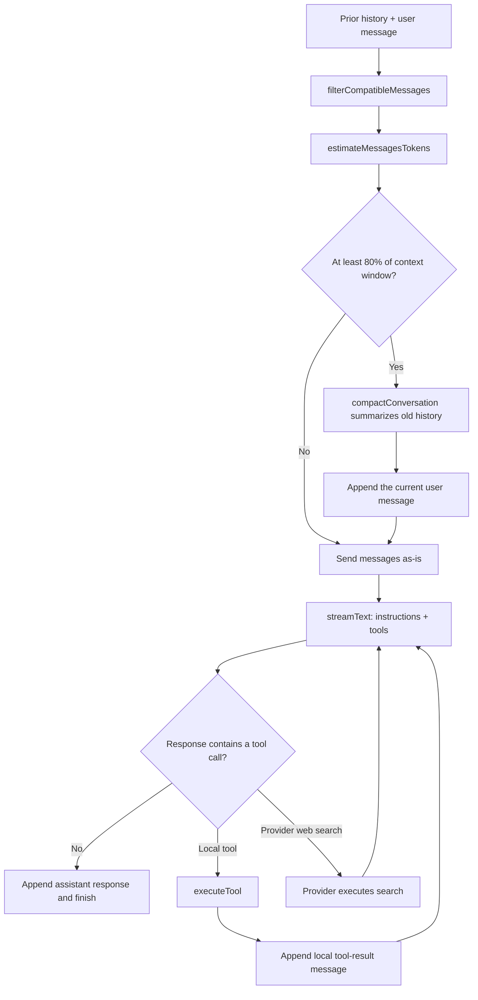

# Context-Aware Agent Capabilities — Deep Dive

This agent now has two related capabilities that make long-running work more
useful: it can use OpenAI's provider-native web search, and it can compact a
conversation before the prompt grows beyond its configured context budget.

They solve different problems:

- **Web search** gives the model fresh external information.
- **Context management** preserves the important parts of a long internal
  conversation so the model can keep working.

Both change what happens around a call to `streamText`, so this guide lives
next to `run.ts` rather than inside only `tools/` or `context/`.

## Start here: the 60-second version

Before each model call, `runAgent()` estimates the size of the conversation.
If it reaches 80% of the selected model's context window, it replaces the old
history with an LLM-produced summary and then appends the user's new message.
The model still receives the normal system instructions and the registered
tools, including `webSearch`.

```text
history + new user message
  → estimate token usage
  → below threshold: send it unchanged
  → above threshold: summarize old history, then restore the new user message
  → call the model with instructions and registered tools
  → model may answer, use a local tool, or use provider-native web search
```

The important boundary is who executes a tool:

| Tool category | Example | Who executes it? | What the agent loop does |
| --- | --- | --- | --- |
| Local function tool | `readFile` | This Node.js process | Calls `executeTool`, then adds a tool-result message. |
| Provider-executed tool | `webSearch` | OpenAI's provider | Lets the provider return the result; it must not call `executeTool`. |

---

## 1. The complete request path

`runAgent()` coordinates the entire operation:



There are two important moments to distinguish:

1. **Before the model call**, the agent manages context size.
2. **During the model call**, the model can select a capability from the tool
   registry.

The first is application-owned state management. The second is model/provider
tool orchestration.

---

## 2. Context windows are a budget

Language models do not have unlimited conversational memory. Every request has
a context window: a finite number of tokens that can include system
instructions, user messages, assistant replies, tool calls, tool results, and
the generated output.

The repository describes each supported model in `context/modelLimits.ts`:

```ts
{
  inputLimit: 272000,
  outputLimit: 128000,
  contextWindow: 400000,
}
```

Those values are used as a planning budget. The code currently compacts at:

```text
contextWindow × DEFAULT_THRESHOLD
400,000 × 0.80 = 320,000 estimated tokens for gpt-5-mini
```

Compacting before the hard limit leaves room for the model's response and the
next tool result. Waiting until the request is already too large risks a
provider error or forced truncation of the oldest conversation turns.

### Model limits and fallback behavior

`getModelLimits(model)` first tries an exact match, then recognizes any
`gpt-5...` name, and finally falls back to conservative defaults. That keeps
the agent usable when a model name is not yet in the registry, but it is not a
substitute for adding accurate limits when a new model becomes intentional.

The values are configuration, not observations. They say what the agent plans
for; they do not report the provider's actual token usage.

---

## 3. Token estimation: useful signal, not exact accounting

`context/tokenEstimator.ts` uses a lightweight heuristic:

```text
estimated tokens = ceil(character count / 3.75)
```

It extracts text from each `ModelMessage`, then counts `assistant` messages as
output and all other message roles as input. Tool result content is included
because the model must read it on the next turn.

This is fast and deterministic, which makes it useful for a UI indicator and
an early compaction decision. It is not an exact tokenizer:

- Different languages, code, punctuation, and JSON tokenize differently.
- Provider-specific message formatting adds tokens not visible in the text.
- `SYSTEM_PROMPT` is supplied through `instructions`, so the current estimate
  does not include its text.
- The estimate does not reserve a precise amount for the next response.

Treat the percentage shown by `TokenUsage.tsx` as a dashboard warning, not a
billing record or guaranteed provider limit.

### What the UI displays

After the agent adds a response or a local tool result to `messages`, it calls
the optional `onTokenUsage` callback with:

```ts
{
  inputTokens,
  outputTokens,
  totalTokens,
  contextWindow,
  threshold,
  percentage,
}
```

`App.tsx` stores that value and `TokenUsage.tsx` renders it. The display is
green below 60% of the configured window, yellow from 60% to below 80%, and
red at or above the 80% compaction threshold.

That timing matters: the value represents the messages currently stored by the
agent after a step, not a live count of partially streamed text.

---

## 4. Compaction preserves meaning, not verbatim history

When the preflight estimate is over the threshold, `runAgent()` calls:

```ts
const compactedHistory = await compactConversation(workingHistory, MODEL_NAME);

messages = [
  ...compactedHistory,
  { role: "user", content: userMessage },
];
```

The current user message is deliberately added **after** compaction. The
summary should describe what happened before this turn; the model must still
see the exact new request that triggered the call.

`compactConversation()` follows four steps:

1. Removes any system messages because `runAgent()` supplies `SYSTEM_PROMPT`
   through `instructions` on every call.
2. Converts the remaining messages into readable `[ROLE]: content` blocks.
3. Uses `generateText` with a summarization prompt that asks for decisions,
   facts, pending work, and the overall goal.
4. Returns a synthetic user summary followed by an assistant acknowledgement.

```text
old user/assistant/tool history
  → summarizer model call
  → [CONVERSATION SUMMARY] user message
  → assistant acknowledgement
  → original new user message
```

The acknowledgement establishes a normal conversational turn after the
summary. It is not a statement the original assistant actually made; it is
scaffolding that helps the next model request continue naturally.

### What compaction keeps and loses

Compaction is lossy by design. It aims to retain the information most likely to
matter later, but it can omit details, exact wording, tool-call IDs, and raw
tool results. This is acceptable only when the summary preserves the active
task and decisions well enough for the next turn.

Use compaction to manage long-lived conversations, not as an audit log. If
exact history must remain retrievable, store it separately and give the agent a
targeted retrieval tool instead of relying on a summary.

### Compaction has a cost

Summarization is an extra model request. It adds latency and usage at the point
where a conversation crosses the threshold. The threshold is therefore a
trade-off:

- A lower threshold compacts earlier, leaving more safety margin but spending
  more on summaries.
- A higher threshold preserves more raw history but increases the chance that
  the next prompt cannot fit.

The present 80% default is a starting policy, not a universal constant. Evals
and production traces should inform whether it is appropriate for real usage.

---

## 5. Native web search is not a local function

`tools/webSearch.ts` registers OpenAI's provider-executed search tool:

```ts
export const webSearch = openai.tools.webSearch({});
```

Unlike `readFile` or `writeFile`, this object has no local `execute` function.
OpenAI runs the search as a built-in provider tool and returns the result as
part of the model response. OpenAI's Responses API documents web search as a
built-in tool, distinct from custom functions that call application code.

The registry still exposes it like any other tool:

```ts
export const tools = {
  readFile,
  writeFile,
  listFiles,
  deleteFile,
  webSearch,
};
```

But the execution path differs. A tool-call chunk can identify
`providerExecuted === true`. `run.ts` reports that the tool started, but does
not put it in the list of local calls for `executeTool`. Attempting to route it
through `executeTool` would fail because there is no local implementation and
would incorrectly fabricate a tool result.

The official OpenAI Responses API describes built-in tools such as web search
separately from custom function calls, and can optionally include web-search
sources in its response. [OpenAI Responses API reference](https://developers.openai.com/api/reference/cli/resources/responses/methods/create)

### Configuration is policy

The empty configuration `{}` accepts the provider defaults. The AI SDK's tool
factory also supports choices such as external-web access, allowed or blocked
domains, search-context size, and approximate user location. Those settings
are product policy, not incidental tuning:

- Domain filters can limit research to trusted sources.
- A larger search context can improve coverage at greater cost and latency.
- Location affects locally relevant results and has privacy implications.
- Citations need explicit product handling if the terminal UI should show or
  preserve the sources used by the model.

Do not add a local `execute` function merely to make web search resemble the
file tools. That would change the ownership model and undermine the provider
integration.

---

## 6. Local tools and provider tools must coexist safely

The registry is intentionally heterogeneous: `readFile` is an application
function, while `webSearch` is provider-executed. That means extension code
must ask more than “what is the tool name?” It must also ask “who owns this
execution?”

```text
tool call received
  ├─ provider executed → provider supplies result in model response
  └─ locally executed  → executeTool runs application code
                         → agent appends a tool-result message
```

This distinction becomes more important as the agent gains file search, code
interpreter, MCP, or approval-gated tools. A single local dispatcher cannot
assume every entry in `tools` has an `execute` function.

The current UI can show a provider tool as started through `onToolCallStart`.
If it needs a completed-state message or source list for provider tools, the
agent loop should consume the corresponding provider result events rather than
inventing a local result string.

---

## 7. Failure modes and debugging order

When long conversations or web research behave unexpectedly, diagnose in this
order:

1. **Confirm the registry.** Is `webSearch` present in `tools`, and are local
   tools still registered as intended?
2. **Check the context estimate.** Compare the displayed percentage with the
   approximate size of the stored messages; remember that it excludes the
   separate system instructions.
3. **Inspect whether compaction ran.** A compacted conversation should contain
   the synthetic summary, acknowledgement, and the exact newest user request.
4. **Separate tool ownership.** A provider-executed call must not pass through
   `executeTool`; a local call must have a valid registered implementation.
5. **Inspect the final model response.** Web-search output and citations come
   from the provider response, while local tool results are added by `run.ts`.

### Test cases worth protecting

- A short conversation never calls the summarizer.
- A conversation above the threshold preserves the new user message after
  compaction.
- An empty history compacts to an empty history without a model call.
- An unknown model uses the documented fallback limits.
- A local tool still calls `executeTool` and produces a `role: tool` result.
- A provider-executed web search does not call `executeTool`.
- Token usage is reported after final responses and local tool results.

The existing eval suite is a good place to add behavioral checks, while pure
context functions can also receive deterministic unit tests without an API key.

---

## Recap: the mental model

The new design is a feedback loop with two forms of controlled expansion:

```text
conversation grows
  → estimate its budget
  → summarize when raw history is too large

model needs fresh information
  → choose provider-native web search
  → provider performs search and returns evidence
```

Context compaction controls how much prior conversation the model carries
forward. Provider-native web search controls how the model gains new external
information. Keeping those responsibilities explicit prevents a long-running
agent from either overflowing its prompt or confusing provider tools with local
application code.
