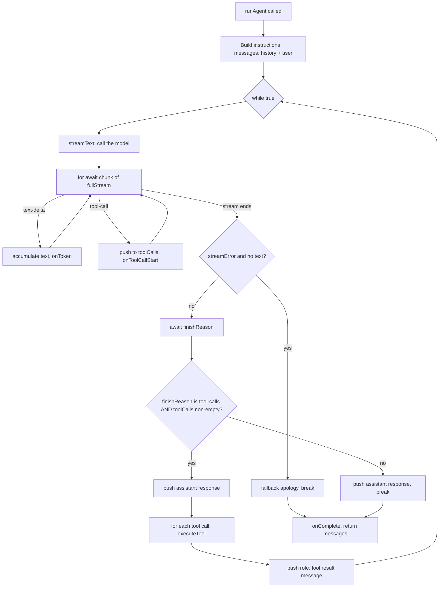

# `run.ts` — Deep Dive

`run.ts` implements the **agent loop**: the piece of code that turns a single
user message into a full conversation with the model, including any tools the
model decides to call along the way. Everything else in the app (`src/ui/App.tsx`
in the terminal UI) is a thin shell around calling `runAgent()` once per user
turn and rendering whatever it reports back via callbacks.

## Start here: one user turn in plain language

When someone sends a message, `runAgent()` does not simply ask the model for
one string. It builds a conversation, lets the model respond, and keeps going
only when the model asks the application to use a tool.

1. Pass the system prompt as instructions, alongside the earlier messages and
   the new user message.
2. Stream the model's response so the UI can show text and tool activity as it
   arrives.
3. If the response is a final answer, save it and finish.
4. If the response asks for tools, run them, add their results to the
   conversation, and ask the model what to do next.

The function returns the updated conversation so the next user turn can
continue where this one left off.

### The three things to keep separate

| Thing | What it is for | Where it appears |
| --- | --- | --- |
| `messages` | The durable conversation sent back to the model on each round. | Built in Section 4; updated in Sections 10–11. |
| `fullResponse` | The text shown to the user during this one call to `runAgent()`. | Started in Section 5; completed in Section 12. |
| `callbacks` | Live UI updates while the function is still running. | Fired while reading chunks and tool activity. |

This distinction prevents a common misunderstanding: streamed text updates the
UI, while `messages` preserves the structured transcript the model needs for a
future turn.

At a high level, it implements the **ReAct pattern** (Reason + Act), which is
the standard shape almost every "agent" you've heard of is built on:

```
loop:
  send the full conversation to the model
  did the model ask to call a tool?
    no  -> that's the final answer, stop
    yes -> run the tool(s), append their results to the conversation, loop again
```



The rest of this document walks the file top to bottom, section by section,
explaining every concept it touches — not just what the code does, but *why*
it's written this way.

### Choose your reading path

- **I want the big picture:** read this section, then Sections 4, 5, 10, 11,
  and 12.
- **I am debugging unexpected tool behavior:** start with Sections 7, 10, and
  11. Those show how a tool request is captured, recognized, and executed.
- **I am debugging the terminal UI:** focus on Sections 3, 7, and 12. They
  explain when callbacks deliver live updates and completion.
- **I need the implementation details:** read the numbered sections in order.

---

## 1. Imports

```ts
import { streamText, type ModelMessage } from "ai";
import { openai } from "@ai-sdk/openai";
import { Laminar } from "@lmnr-ai/lmnr";
import { tools } from "./tools/index.ts";
import { SYSTEM_PROMPT } from "./system/prompt.ts";

import type { AgentCallbacks, ToolCallInfo } from "../types.ts";

import {filterCompatibleMessages} from "./system/filterMessages.ts";
import { executeTool } from "./executeTools.ts";
```

**Named imports vs. type-only imports.** `import { streamText, type ModelMessage } from "ai"` pulls in two things from the same module, but they're fundamentally different kinds of things:

- `streamText` is a **value** — a real function that exists in the compiled JavaScript output and gets called at runtime.
- `ModelMessage` is a **type** — a TypeScript-only construct, used purely for compile-time checking. It has zero representation in the emitted JS.

The inline `type` keyword (`type ModelMessage`) tells the compiler "erase this one specifically." A separate statement — `import type { AgentCallbacks, ToolCallInfo } from "../types.ts"` — does the same thing for a whole import statement at once, which is why that line uses `import type` instead of `import`. Both forms exist for the same reason: modern toolchains (like `tsx`, which this project's `dev`/`start` scripts use, or `esbuild`) often transpile files one at a time without seeing the rest of the program, so they can't always infer on their own whether an imported name is a type or a value. Marking it explicitly removes the ambiguity and guarantees dead code (a type doesn't need be `require`d or bundled) gets stripped correctly.

**Provider-agnostic SDK design.** `ai` (the Vercel AI SDK) and `@ai-sdk/openai` are deliberately two separate packages. `streamText`, `generateText`, and friends in the `ai` package don't know anything about OpenAI, Anthropic, or any specific vendor — they just expect to be handed a "language model" object that conforms to a common interface. `openai("gpt-5-mini")` is a **factory function** from the provider package that produces exactly that kind of object. This is why swapping providers in an app like this is usually a one-line change (swap the import and the factory call) rather than a rewrite: the calling code (`streamText({ model, messages, tools, ... })`) is identical regardless of which vendor is behind `model`.

**Laminar.** `@lmnr-ai/lmnr` is an observability/tracing SDK purpose-built for LLM applications — think OpenTelemetry, but with concepts like "this span is one call to the model" or "this span is one tool execution" built in, so traces show up in a UI meaningfully rather than as generic HTTP spans. `Laminar` is the SDK's top-level control object, used below to initialize tracing for the process.

**Explicit `.ts` extensions.** `./tools/index.ts`, `./system/prompt.ts`, `../types.ts`, etc. all include the file extension. This project runs on Node's native TypeScript support / `tsx`, which — unlike bundler-based setups such as Webpack or Vite — does *not* resolve extensionless imports for you. `import { tools } from "./tools/index"` (no `.ts`) would fail to resolve at runtime here.

---

## 2. Module-level constants and side effects

```ts
const MODEL_NAME = "gpt-5-mini";

Laminar.initialize({
    projectApiKey: process.env.LMNR_PROJECT_API_KEY,
});
```

This code is **not inside any function** — it sits at the top level of the module. That matters a lot: it runs exactly **once**, at the moment this module is first `import`ed anywhere in the program (Node caches modules, so re-importing the same file elsewhere reuses the already-executed instance rather than running this again). It does **not** run once per `runAgent()` call.

This is a common and reasonable pattern for SDK setup — you generally want tracing/logging/config initialized once at process startup, not re-initialized on every request. But it's worth noticing as a category of code, because module-level side effects can be a source of subtle bugs: if this file is ever imported for its types alone in a context where you didn't expect network/config side effects (e.g. a test file), `Laminar.initialize` still fires.

`process.env.LMNR_PROJECT_API_KEY` reads an **environment variable**. `process` is a Node.js global; `process.env` is a plain object of `string | undefined` values populated from the OS environment (and, in this project, from a `.env` file loaded via `tsx --env-file=.env`, per the `dev`/`start` scripts in `package.json`). There's no check here for whether the key is actually set — if it's `undefined`, `Laminar.initialize` just receives `undefined` and whatever happens next (no-op, silent failure, or an internal error) happens without this code being aware of it.

---

## 3. Function signature

```ts
export async function runAgent(
  userMessage: string,
  conversationHistory: ModelMessage[],
  callbacks: AgentCallbacks,
): Promise<ModelMessage[]> {
```

**`async function`.** Declaring a function `async` does two things: it guarantees the function always returns a `Promise` (even if you `return` a plain value inside it, JS automatically wraps it), and it unlocks the `await` keyword inside the function body, letting you write code that *looks* synchronous while actually suspending execution until a Promise settles. If something inside throws (synchronously or via a rejected `await`), the function doesn't throw synchronously to its caller — the returned Promise rejects instead, which is why callers of `runAgent` need a `try`/`catch` around an `await runAgent(...)` call (as `App.tsx` does), not a plain `try`/`catch` around a synchronous call.

**`Promise<ModelMessage[]>`.** This is a **generic type** — `Promise<T>` is parameterized over "the type of value it eventually resolves to." Here `T` is `ModelMessage[]`, meaning: "calling this function gives you something that will *eventually* produce the full updated conversation array," not the array itself synchronously.

**The `AgentCallbacks` parameter — the observer/callback pattern.** Rather than `runAgent` returning a stream object for the caller to manually pull from, it accepts a bag of functions up front (`onToken`, `onToolCallStart`, `onToolCallEnd`, `onComplete`, and more depending on what `AgentCallbacks` declares) and invokes them at the right moments as it works. This is the classic **observer pattern**: `runAgent` doesn't know or care *what* is listening — a terminal UI, a web UI, a test harness — it just calls `callbacks.onToken(text)` whenever a token arrives and lets the caller decide what to do with that (print it, animate it, buffer it). This decoupling is what lets the exact same agent loop power a React-based terminal UI (`App.tsx`) without `run.ts` importing anything React-related.

---

## 4. Building the initial message array

```ts
const workingHistory = filterCompatibleMessages(conversationHistory);
const messages: ModelMessage[] = [
  ...workingHistory, // conversation so far fitered to only include compatible messages
  {role: 'user', content: userMessage},
];
```

**Why the whole history gets resent.** LLM chat APIs are **stateless** between
calls — there is no server-side "session" the model remembers. Every API call
needs the relevant prior user/assistant/tool exchange, or the model has no
memory of it. `runAgent` also sends `SYSTEM_PROMPT` as `instructions` on each
call. Reconstructing those inputs for every request is not an optimization
choice; it is how chat continuity works with these APIs.

**The spread operator (`...workingHistory`).** Inside an array literal,
`...someArray` unpacks each element of that array into the new array *at that
position*, rather than nesting it as a single element. `[a, ...[b, c], d]`
produces `[a, b, c, d]`, not `[a, [b, c], d]`. Here it means: take every
message from the filtered prior history and lay them out in order before the
new user message.

**Instructions, ordering, and roles.** The agent passes `SYSTEM_PROMPT` through
`streamText`'s `instructions` option rather than adding a `system` message to
`messages`. The message array therefore contains chronological
`user`/`assistant` turns (and `tool` turns when tools are involved), with the
newest `user` message last. The instructions and ordering both affect model
behavior; neither is cosmetic.

**`filterCompatibleMessages`.** Defined elsewhere (`./system/filterMessages.ts`), but worth knowing it exists: it strips messages from the incoming history that would make the array invalid to resend — for example, a dangling assistant tool-call message with no matching `tool` result message would produce a malformed request. This is a sanitization step applied before folding history back in.

---

## 5. The loop and the streaming call

```ts
let fullResponse = "";
while (true) {
  const result = streamText({
    model: openai(MODEL_NAME),
    instructions: SYSTEM_PROMPT,
    messages,
    tools,
    experimental_telemetry: {
      isEnabled: true,
      tracer: getTracer(),
    }
  })
```

**`let fullResponse = ""` outside the loop.** Declared before `while (true)`, so it persists and accumulates *across* loop iterations. Each iteration of this loop represents one round-trip to the model; if the model writes some text, calls a tool, and then writes more text in response to the tool's result, `fullResponse` needs to carry the first chunk of text forward into the second iteration rather than being reset. Contrast this with variables declared *inside* the loop body (see §6) — noticing which variables live outside vs. inside the loop is one of the most useful habits when reading loop-heavy code.

**`while (true)` as the standard agent-loop shape.** You don't know ahead of time how many rounds of "model wants a tool, run it, tell the model" will happen — it could be zero (the model just answers directly) or several (read a file, then list a directory, then answer). An unbounded `while (true)` with explicit `break` statements inside is the natural way to express "keep going until some internal condition says stop." The corollary: every single code path through the loop body must eventually hit a `break` (or `return`/`throw`) — an infinite loop with no way out is a real risk any time you write this shape, so it's worth explicitly checking that every branch terminates. In this file there are three `break`s: the error-fallback path, the "final answer" path, and — implicitly — control falling through to loop again after tool execution.

**`streamText(...)` is not awaited.** This is a deliberate and important detail. Unlike `generateText` (which this file used to call, before an earlier refactor in this project's history — see the git log for `run.ts`), which returns a single Promise that only resolves once the *entire* response has been generated, `streamText` returns **immediately** with a `result` object. That object exposes several properties that are themselves Promises or async iterables, resolving progressively as the underlying HTTP response streams in:

- `result.fullStream` — an **async iterable** of incremental chunks (see §6).
- `result.finishReason` — a **Promise** that resolves once the model is done, telling you *why* it stopped.
- `result.response` — a **Promise** that resolves to the SDK's structured representation of what was said.

This is what makes token-by-token UI streaming possible: you can start reacting to `fullStream` chunks the instant they arrive, well before `finishReason` or `response` have resolved.

**`tools` passed into `streamText`.** This is what turns a plain chat completion into an agentic call: giving the model a list of available tools (name, description, parameter schema) lets it, per response, choose to either produce text or request a tool invocation (what's commonly called "function calling" or "tool use" under the hood). Without passing `tools` here, the model has no way to ever produce a `tool-calls` finish reason.

**`experimental_telemetry`.** Enables telemetry for this `streamText` call. Laminar uses the process-level configuration established by `Laminar.initialize`, so model calls can be inspected in its UI when tracing is configured.

---

## 6. Per-iteration state

```ts
const toolCalls: ToolCallInfo[] = [];
let currentText = "";
let streamError: Error | null = null;
```

These three are declared **inside** the loop body, so — unlike `fullResponse` above — they're freshly reset to empty/null on every single iteration. `toolCalls` collects whatever tool requests show up in *this* iteration's response only; `currentText` accumulates *this* iteration's text only (it later gets folded into the persistent `fullResponse`).

`streamError: Error | null` is a **union type**: the variable can hold either an `Error` object or the literal value `null` — nothing else. Initializing explicitly to `null` (rather than leaving it `undefined`) is a common TypeScript idiom for "definitely-empty, to-be-filled-in-later" state, and it pairs naturally with a later `if (streamError)` truthiness check to ask "did anything go wrong this iteration?"

---

## 7. Consuming the stream

```ts
try {
  for await (const chunk of result.fullStream) {
    if (chunk.type === "text-delta") {
      currentText += chunk.text;
      callbacks.onToken(chunk.text)
    }

    if (chunk.type === "tool-call") {
      const input = 'input' in chunk ? chunk.input : {};
      toolCalls.push({
        toolCallId: chunk.toolCallId,
        toolName: chunk.toolName,
        args: input as any
      });
      callbacks.onToolCallStart(chunk.toolName, input);
    }
  }
} catch (e) {
```

**`for await (const x of asyncIterable)`.** This is a distinct construct from a regular `for (const x of iterable)`. `result.fullStream` is an **async iterable** — conceptually, a sequence of values where producing the *next* one is itself an asynchronous operation (because the next chunk hasn't arrived over the network yet). A plain `for...of` only knows how to pull *synchronously available* values and would fail outright on something like this. `for await...of` is sugar that automatically `await`s each "give me the next value" step before binding it to `chunk`, effectively turning "wait for network data, repeatedly" into a loop that reads like ordinary iteration.

**Discriminated unions and type narrowing.** `chunk` is typed as a union — something like `{type: "text-delta", text: string} | {type: "tool-call", toolCallId: string, toolName: string, ...} | {type: "..."} | ...` (the AI SDK defines several chunk variants for a stream: text, tool calls, reasoning, errors, finish events, etc.). The shared `type` field acts as the **discriminant**. When you write `if (chunk.type === "text-delta")`, TypeScript doesn't just check a string at runtime — it **narrows** the static type of `chunk` for the rest of that `if` block to only the variant where `type` is `"text-delta"`. That's why `chunk.text` is accessible without any cast inside that block: the compiler has already proven, from the check itself, that this specific chunk shape has a `.text` field. This pattern — one field acting as a tag that unlocks the rest of the object's shape — is one of the most common and most useful idioms in TypeScript once you're working with data that can take several forms.

**`'input' in chunk` — the `in` operator as a runtime type guard.** This checks, at runtime, whether the property `input` actually exists on the `chunk` object, and TypeScript uses that check to narrow the type similarly to the discriminant check above. It's an extra layer of defensiveness on top of the `type === "tool-call"` check — useful when the exact shape of a union member is uncertain, loosely typed, or when a library's types don't perfectly capture every runtime possibility.

**`args: input as any` — a flagged weak point.** `as any` is a **type assertion** that switches off type checking for that value entirely — TypeScript will no longer complain no matter what you do with `input` afterward. This is different from a *narrowing* assertion like `input as Record<string, unknown>`, which would still allow some checking. Seeing `as any` is generally worth treating as a small red flag when reading code: it usually means "I'm not confident what shape this actually is," and it silently disables a safety net exactly where a tool's arguments — untrusted-ish, model-generated input — are being accepted.

**Where the callbacks actually fire.** `callbacks.onToken(...)` and `callbacks.onToolCallStart(...)` are called **immediately**, chunk by chunk, inside this loop — not batched up and delivered once at the end. This is the mechanism that makes text appear to "stream" character-by-character in the UI: each `text-delta` chunk triggers an immediate callback invocation, well before the overall `streamText` call (or the surrounding `while(true)` loop) has finished.

---

## 8. Catching stream errors

```ts
} catch (e) {
  streamError = e as Error;

  if (!currentText && !streamError.message.includes("No output generated ")) {
    throw streamError;
  }
}
```

**`catch (e)` and `unknown`.** In modern TypeScript, a caught value in a `catch` clause is typed `unknown` by default, not `Error`. This is technically correct: JavaScript lets you `throw` *any* value at all — a string, a number, a plain object — not just `Error` instances, so the compiler can't assume more than "something was thrown."

**`e as Error` — an assumption, not a guarantee.** This is a type assertion telling the compiler "trust me, treat this as an `Error`," which is what makes `.message` accessible on the next line. If something ever threw a non-`Error` value, `.message` would just be `undefined` at runtime rather than causing a crash — a silent-wrong-data failure mode rather than a loud one, which is a good reason to be cautious around `as` assertions on caught values in general.

**The two-condition guard.** `!currentText && !streamError.message.includes("No output generated ")` combines two checks with logical AND: "we produced no text at all this iteration" AND "the error message doesn't match this known, expected SDK quirk." Only when **both** hold does the code `throw streamError` — re-throwing propagates the error out of `runAgent` entirely, ultimately caught by the UI layer's own `try`/`catch` around its `await runAgent(...)` call. In every other case (there *was* some text, or the error matches the known quirk), the error is captured into `streamError` but the function **keeps running** past the `catch` block — the error is deliberately swallowed rather than fatal.

This encodes a specific, learned piece of knowledge about the AI SDK's behavior: apparently, when a model's response consists *only* of tool calls with no accompanying text, this version of the SDK throws an error containing `"No output generated"` rather than completing cleanly. Rather than treating that as a real failure, this code recognizes the specific message and treats it as an expected, recoverable condition.

---

## 9. Post-stream bookkeeping and the error fallback

```ts
fullResponse += currentText;

if (streamError && !currentText) {
  fullResponse = "Sorry about that."
  callbacks.onToken(fullResponse)
  break;
}
```

`fullResponse += currentText` folds this iteration's accumulated text into the running total that persists across the whole `while (true)` loop — relevant when a final answer arrives across multiple iterations (e.g. some text, then a tool call, then more text).

The `if` block is the loop's **error-fallback exit condition**: if something went wrong *and* it produced literally no usable text, the user shouldn't be left staring at nothing — a canned apology is set as the final response, delivered through the same `onToken` callback path used for normal streaming (so the UI doesn't need a separate code path to render it), and the loop `break`s. Note the narrower framing compared to a naive read: this only fires when there's *both* an error *and* zero text — a tool-call-only response that hit the expected "No output generated" quirk but was otherwise fine wouldn't necessarily have zero text in every case, and (as covered in the loop-exit summary below) this is deliberately the *only* early-exit check before the code goes on to inspect `finishReason` — there's no longer a blanket "if no error at all, stop here" check preceding it.

---

## 10. Deciding whether to run tools

```ts
const finishReason = await result.finishReason;

if (finishReason !== 'tool-calls' || toolCalls.length === 0) {
  const responseMessages = await result.response;
  messages.push(...responseMessages.messages)
  break;
}
```

**`await result.finishReason`.** Another of `streamText`'s lazily-resolving properties, awaited here now that the stream itself has been fully consumed. `finishReason` tells you *why the model stopped generating* — common values include `"stop"` (a natural end to a text answer), `"tool-calls"` (the model wants to invoke one or more tools before continuing), and `"length"` (it hit a token limit). This is the actual signal the whole loop is built around: it's the one authoritative way to distinguish "the model is done, this is the final answer" from "the model needs something before it can finish."

**The compound condition.** `finishReason !== 'tool-calls' || toolCalls.length === 0` combines two independent checks with logical OR: either the model itself reports it stopped for a reason *other than* wanting tools, **or** — as a defensive fallback — it did report `tool-calls` but the streaming loop above somehow captured zero of them. Either way, the code treats this as a **final answer**: no tools to run, so append the model's own response messages to the conversation and `break` out of the outer loop. This is the loop's "success" exit path, as opposed to the "error" exit path in §9.

**`await result.response` and why it's used instead of hand-building a message.** Rather than constructing `{role: 'assistant', content: fullResponse}` manually from the text you accumulated by hand, the code awaits the SDK's own canonical representation of what the assistant said. This matters because a real assistant turn that included tool calls needs to encode that tool-call metadata (which tool, what arguments, what ID) in exactly the shape the provider's API expects for a valid follow-up request — something a hand-rolled `{role, content}` object built from plain text wouldn't capture correctly.

---

## 11. Executing tools

```ts
const responseMessages = await result.response;
messages.push(...responseMessages.messages)

for (const tc of toolCalls) {
  const result = await executeTool(tc.toolName, tc.args);

  callbacks.onToolCallEnd(tc.toolName, result);

  messages.push({
    role: 'tool',
    content: [{
      type: 'tool-result',
      toolCallId: tc.toolCallId,
      toolName: tc.toolName,
      output: {type: 'text', value: result}
    }],
  });
}
```

The same `result.response` push seen in §10 happens here too — but this time execution does **not** `break`, because `finishReason === 'tool-calls'` and at least one tool call was captured, so the code proceeds to actually run what was requested.

**Sequential, not parallel, execution.** `for (const tc of toolCalls)` is a plain synchronous `for...of` loop — it's fine to `await` inside it (you can `await` inside any loop body, sync or async), but each iteration's `await executeTool(...)` fully completes before the next one begins. If the model requested three independent tool calls in one turn (e.g. read three unrelated files), they run **one after another** here, not concurrently via something like `Promise.all`. That's a real design trade-off worth naming explicitly: it costs latency (three sequential round-trips instead of one parallel batch) but buys simplicity and a deterministic, easy-to-reason-about order in which tool-result messages get appended to the conversation.

**Variable shadowing.** `const result = await executeTool(...)` introduces a *brand-new* `result` binding, scoped to this `for` loop's block. There is already an outer `const result = streamText(...)` from line 32 that is still technically in scope at this point in the function — but because both are declared with `const` inside their own block scopes, the inner one **shadows** the outer one for the remainder of this loop body without any conflict or reassignment. This is legal and common, but it's a classic readability trap: skimming the file, you might assume every `result` refers to the same thing, when in fact there are two entirely separate values sharing a name in different scopes. It's worth deliberately noticing shadowing like this whenever you see the same identifier declared twice in nested blocks.

**The tool-result round trip — how tool use actually works.** This is the mechanistic core of "an LLM using a tool": the model itself never executes anything. What actually happens is a two-message protocol:

1. An **assistant** message (pushed in §10/§11 via `result.response`) that says, in effect, "I'd like to call tool X with these arguments," tagged with a `toolCallId`.
2. A **`role: 'tool'`** message, constructed by hand here, that correlates back to that exact call via the same `toolCallId`, carrying whatever the tool actually returned as its `output`.

Once both of those are appended to `messages`, the outer `while (true)` loop runs again, sending the *updated* transcript — now including the tool's result — back to the model. The model reads that result as part of its next turn and reacts to it (answers using the data, calls another tool, etc.). Every "agent with tools" you've used, regardless of framework, boils down to this same request → execute-externally → inject-result → re-prompt cycle.

**The `output` shape.** `{type: 'text', value: result}` (where `result` is whatever string `executeTool` returned) reflects the AI SDK's `ModelMessage` schema for tool outputs, which supports multiple output kinds (`text`, `json`, `error-text`, etc.) so the SDK can correctly serialize each into whatever format the underlying provider's API expects for a tool-result turn.

---

## 12. Wrapping up

```ts
callbacks.onComplete(fullResponse);
return messages
```

Once the outer `while (true)` loop finally `break`s — via either the error-fallback path (§9) or the final-answer path (§10) — `onComplete` fires exactly once, telling the caller "streaming is fully done, here is the final assistant text," which is what the UI uses to stop showing a "typing" indicator and commit the finished message.

**Why the entire `messages` array is returned, not just the newest reply.**
The return type is `Promise<ModelMessage[]>`, and the function hands back the
whole, fully mutated conversation — original history, every intermediate
assistant/tool exchange from any tool calls, and the final answer — not merely
the latest message. The system prompt is sent separately as `instructions` on
each model call. The caller (`App.tsx`) stores this returned array as
`conversationHistory` and passes it back into the next `runAgent` call. The
function is not just answering one message; it returns the up-to-date
transcript.

### Every way the loop ends

The loop is intentionally open-ended, but it has two explicit exits:

| What happened? | What `runAgent()` does | Result for the caller |
| --- | --- | --- |
| Streaming failed before any usable text arrived. | Sends a short fallback message and breaks. | `onComplete` receives the fallback text. |
| The model finished without a usable tool request. | Adds the assistant response to `messages` and breaks. | `onComplete` receives the accumulated answer and the updated transcript is returned. |

A valid tool request is not an exit: its assistant message and tool result are
added to `messages`, then the next loop iteration begins. This is the only
path that repeats.

---

## Recap: the mental model

Strip away the telemetry, callbacks, and error-handling scaffolding, and the entire file is one idea, repeated:

```
loop:
  send the full conversation to the model
  did it ask for a tool?
    no  -> record final answer, stop
    yes -> run the tool(s), append results to conversation, loop again
```

Everything else in this file — the discriminated `chunk.type` union, the `for await` streaming consumption, the `finishReason` branch, the `tool`-role message round trip, the callback firing points — exists purely in service of that one control-flow shape. Once that clicks, the rest is plumbing.
