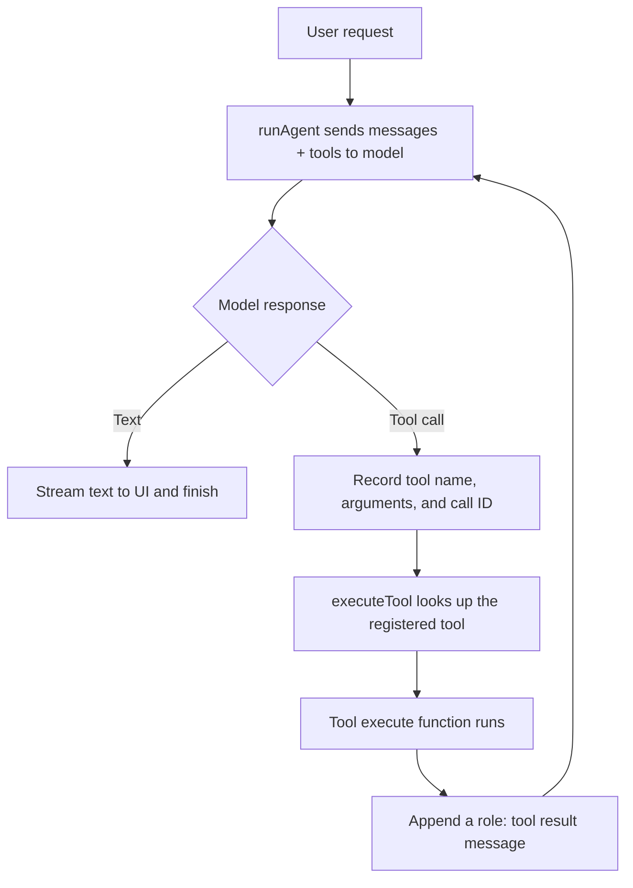

# Tools — Deep Dive

The files in `src/agent/tools/` give the agent the ability to do more than
write text. A **tool** is a capability the model may request—such as reading a
file or getting the current time—that the application actually performs.

The important distinction is simple: the model can **ask** for a tool, but it
cannot run code or touch the filesystem by itself. The agent loop receives the
request, runs the matching TypeScript function, and sends the result back to
the model.

## Start here: the 60-second version

Think of a tool as a button the model is allowed to press. Each button has:

1. A **name** that identifies the capability, such as `readFile`.
2. A **description** that helps the model decide when to use it.
3. An **input schema** that describes the arguments it may supply.
4. An **`execute` function** that performs the real work and returns a result.

For one tool call, the path looks like this:

```text
model selects a tool
  → run.ts records the request
  → executeTools.ts finds and runs the implementation
  → the result becomes a tool message
  → the model sees the result and continues or answers
```

Only tools in the exported `tools` object in `index.ts` are available to the
model. Creating a file that exports a tool is not enough by itself; it must be
registered in that object.

### Current tool set

| Tool | Input | What it does | Side effect |
| --- | --- | --- | --- |
| `readFile` | `path` | Reads a UTF-8 file and returns its contents. | Reads disk data. |
| `writeFile` | `path`, `content` | Creates parent folders if needed, then writes a UTF-8 file. | Creates or overwrites files. |
| `listFiles` | `directory` (defaults to `.`) | Lists immediate directory entries. | Reads directory metadata. |
| `deleteFile` | `path` | Removes one file with `unlink`. | Permanently removes a file. |
| `dateTime` | none | Returns the current ISO timestamp. | None beyond reading the clock. |

The first four live in `file.ts`; `dateTime` lives in `dateTime.ts`.

---

## 1. Where tools fit in the agent loop

`runAgent()` in `../run.ts` passes the registry to AI SDK's `streamText` call:

```ts
streamText({
  model: openai(MODEL_NAME),
  instructions: SYSTEM_PROMPT,
  messages,
  tools,
});
```

That `tools` value is part of the model's input. The model receives the tool
names, descriptions, and schemas alongside the conversation. It can either
write a normal answer or emit a structured tool-call request.



This is a request/response loop, not a direct model-to-filesystem connection.
The model never receives Node's `fs` module; it receives only a description of
what the application is willing to do.

### The responsibilities are deliberately separate

| Layer | Owns | Does not own |
| --- | --- | --- |
| `tools/*.ts` | One capability's description, schema, and implementation. | The model loop or chat UI. |
| `tools/index.ts` | The model-visible registry. | How calls are streamed or stored. |
| `executeTools.ts` | Runtime lookup and execution of one requested tool. | Deciding whether a tool should be called. |
| `run.ts` | Conversation loop, callbacks, and tool-result messages. | Individual filesystem operations. |
| The model | Choosing whether a tool looks useful. | Performing the privileged action. |

This separation makes it easier to change one tool without rewriting the
agent loop, and to test tool behavior without making a real model call.

---

## 2. The shape of a tool

All current tools use AI SDK's `tool(...)` helper with Zod for the input
schema:

```ts
export const exampleTool = tool({
  description: "Explain exactly when this tool should be used.",
  inputSchema: z.object({
    value: z.string().describe("What this argument means"),
  }),
  execute: async ({ value }) => {
    // Perform the capability and return a model-readable result.
    return `Processed: ${value}`;
  },
});
```

Each field matters for a different reason:

- **`description`** is model-facing product design. Clear descriptions make
  the right choice more likely; vague or overlapping descriptions make tool
  selection unreliable.
- **`inputSchema`** is both a contract and model-facing documentation. The
  model sees argument names and their descriptions, while the SDK uses the
  schema to validate generated input.
- **`execute`** is application code. It receives the validated input and
  returns the observation or outcome the model needs for its next step.

The tool implementation should return useful, concise text. For example,
`readFile` returns the file contents rather than a Boolean, because the model
needs the contents to answer questions about the file.

### A tool description is an API for the model

The model cannot infer an implementation from a TypeScript filename. It makes
its choice from the definition sent in `tools`. A good description answers:

- What does this tool do?
- When should the model use it instead of another tool?
- What does a successful result mean?
- Are there important risks, such as overwriting or deleting data?

For example, `readFile` explicitly says to use it for reading file contents.
That makes it distinct from `listFiles`, which is for discovering names in a
directory before choosing a file to read.

---

## 3. The registry: what the model can actually call

`index.ts` imports the active tools and exports them in one object:

```ts
export const tools = {
  readFile,
  writeFile,
  listFiles,
  deleteFile,
  dateTime,
};
```

This object is the **allowlist**. `run.ts` passes this exact object to the
model, and `executeTools.ts` uses the same object to find the implementation
after the model requests a call.

That shared registry prevents a dangerous mismatch where the model can request
a named capability that the application cannot execute. If the name is absent,
`executeTool` returns:

```text
Unknown tool. this does not exist
```

The module also exports `fileTools`, a convenience grouping for the four
filesystem tools. It is not passed to `streamText`, so it does not expose a
second set of model-visible capabilities.

### Why `dateTime` stays in the registry

The file-tool addition extends the registry; it should not replace existing
capabilities. Keeping `dateTime` alongside the file tools preserves the
agent's ability to answer time-related requests while adding filesystem work.

---

## 4. How a requested tool is executed

When `run.ts` receives a `tool-call` stream chunk, it keeps three pieces of
evidence:

```ts
{
  toolCallId: chunk.toolCallId,
  toolName: chunk.toolName,
  args: input,
}
```

After the model turn ends with `finishReason === "tool-calls"`, the agent runs
each call sequentially:

```ts
for (const tc of toolCalls) {
  const result = await executeTool(tc.toolName, tc.args);
  callbacks.onToolCallEnd(tc.toolName, result);

  messages.push({
    role: "tool",
    content: [{
      type: "tool-result",
      toolCallId: tc.toolCallId,
      toolName: tc.toolName,
      output: { type: "text", value: result },
    }],
  });
}
```

The `toolCallId` is especially important. It links the tool-result message to
the specific assistant request that caused it. The next model call sees both
the original request and its matching result.

### `executeTool`: a narrow dispatch boundary

`executeTools.ts` does four things:

1. Looks up `name` in the `tools` allowlist.
2. Returns a plain error string for an unknown or non-executable tool.
3. Calls the selected tool's `execute` function.
4. Converts the returned value to a string for the conversation.

```ts
const result = await execute(args as never, {
  toolCallId: "",
  messages: [],
  context: {},
});

return String(result);
```

The `args as never` cast is localized to this dynamic-dispatch boundary. The
registry contains tools with different input shapes, so TypeScript cannot know
which shape belongs to a string selected at runtime. The model-generated input
is validated through each tool's schema before execution; this cast does not
add runtime validation.

The execution options currently use an empty `toolCallId`, empty `messages`,
and empty `context`. That is sufficient for the current tools, which do not
depend on those values. A future tool that needs request history, cancellation,
or application context should extend this boundary rather than assuming those
values are available.

### Results are always text in this agent

`run.ts` builds every tool result as:

```ts
output: { type: "text", value: result }
```

That means even an error is evidence for the model, not an exception that ends
the entire agent loop. The model can read “File not found” and choose a
different path or ask the user for clarification.

---

## 5. File tools: behavior and trade-offs

The file tools use Node's promise-based filesystem API. They do not impose a
workspace root, an allowlist of directories, a size limit, or a confirmation
step. Relative paths resolve from the Node process's current working directory;
absolute paths are also accepted.

This makes the tools useful for a local development agent, but it is a real
security boundary. Exposing these tools to untrusted prompts or running them
with broad filesystem permissions can disclose, overwrite, or delete data.

### `readFile`

```ts
readFile({ path: "package.json" })
```

The tool reads the full file as UTF-8 text and returns it unchanged. A missing
file becomes `Error: File not found: <path>`; other failures become `Error
reading file: <message>`.

Use this when the agent already knows the file it needs. For an unfamiliar
project, the usual sequence is `listFiles` first, then `readFile`.

### `writeFile`

```ts
writeFile({
  path: "notes/todo.txt",
  content: "Ship the change\n",
})
```

Before writing, the tool creates the parent directory with
`fs.mkdir(dirname(path), { recursive: true })`. It then calls
`fs.writeFile`, which overwrites an existing file without a backup or prompt.
On success it reports how many characters it wrote.

That directory creation is convenient for a new file, but it also means a
misspelled path can create an unexpected directory tree. If overwrites need
approval, that policy must be implemented outside the current tool; the text
“overwrites if it does” is information for the model, not enforcement.

### `listFiles`

```ts
listFiles({ directory: "src/agent" })
```

The input schema defaults `directory` to `.`. The tool uses `fs.readdir` with
`withFileTypes: true` and produces one line per immediate entry:

```text
[file] run.ts
[dir] tools
```

It does not recurse into subdirectories, sort entries, or read file contents.
Any entry that is not a directory is labeled `[file]`, including a symbolic
link. A nonexistent directory produces a clear not-found result.

### `deleteFile`

```ts
deleteFile({ path: "notes/obsolete.txt" })
```

The tool uses `fs.unlink`. It deletes a file immediately and has no recovery
mechanism. It cannot remove a directory; those failures are returned as error
text. The description says “Use with caution,” but the current agent does not
ask the user to approve deletion.

### The missing approval policy

`AgentCallbacks` includes `onToolApproval`, but `run.ts` does not call it for
any current tool. Consequently, `writeFile` and `deleteFile` execute as soon
as the model requests them. If this agent will handle untrusted input or
important files, add a policy layer before calling `executeTool`:

```text
tool call received
  → is this path within an allowed workspace?
  → is this operation destructive?
  → request user approval if required
  → execute or return a refusal result
```

---

## 6. `dateTime`: a side-effect-free example

`dateTime.ts` shows the smallest useful tool:

```ts
export const dateTime = tool({
  description: "Returns the current time and date...",
  inputSchema: z.object({}),
  execute: async () => new Date().toISOString(),
});
```

It has no input and returns a single string. This is a good reference when
adding a read-only, deterministic capability: keep the description specific,
keep the schema honest, and return data the model can use directly.

Unlike the filesystem tools, its output naturally varies over time. It is
therefore a poor candidate for an eval that compares an exact timestamp; an
eval should instead assert that the model chose the tool when a current-time
answer is needed.

---

## 7. Tools and evals are related, but not the same thing

The files under `evals/` test whether the model chooses useful tools and uses
their mocked results. They intentionally do not execute this folder's real
filesystem functions, because evals should be safe and repeatable.

That separation creates one maintenance rule: keep the model-visible contracts
aligned across production and evals.

| Concern | Production tool | Current selection eval fixture |
| --- | --- | --- |
| `readFile` input | `path` | `path` |
| `writeFile` input | `path`, `content` | `path`, `content` |
| `listFiles` input | `directory` | `path` |
| `deleteFile` input | `path` | `path` |

The `listFiles` mismatch matters: the current selection eval can show that a
model chose the right *name*, but it cannot prove the generated arguments work
with the production implementation. If the eval suite begins validating tool
arguments or executing production-like mocks, update one side so both use the
same contract.

For the full eval architecture, see [`../../../evals/evals.md`](../../../evals/evals.md).

---

## 8. Adding a tool safely

Use this checklist for a new capability:

1. **Define a focused tool.** Put its description, Zod input schema, and
   `execute` implementation in a dedicated module or a clearly related module.
2. **Make the description discriminating.** Explain when to use this tool
   instead of nearby alternatives.
3. **Validate and constrain inputs.** Treat model-generated paths, commands,
   and URLs as untrusted input. Enforce allowed roots, size limits, and other
   relevant boundaries in application code.
4. **Return model-readable outcomes.** Prefer useful results or clear error
   text over opaque booleans.
5. **Register the tool in `tools`.** Until it appears in the registry, the
   model cannot call it and `executeTool` cannot find it.
6. **Add or update eval fixtures.** Cover the positive case, alternatives the
   model should avoid, and any multi-step workflow.
7. **Test the implementation independently.** File tools should be exercised
   in a temporary directory, never against important project files.
8. **Run the quality checks.** At minimum, run focused Biome checks,
   `npm run gate`, and `npm run build`.

### A practical extension example

Suppose the agent needs `moveFile`:

```text
add a precise description and { from, to } schema
  → use fs.rename in execute
  → decide whether moving needs user approval
  → add moveFile to tools/index.ts
  → test valid moves, a missing source, and a conflicting destination
  → add evals for choosing moveFile rather than read/write/delete
```

Do not create a generic “filesystem tool” that accepts an arbitrary operation
string. Small, named tools give the model better guidance, allow narrower
policies, and make eval failures much easier to diagnose.

---

## Recap: the mental model

Tools are the controlled bridge between language-model decisions and real
application capabilities:

```text
registry defines what is allowed
  → descriptions and schemas guide the model's choice
  → run.ts captures a structured request
  → executeTools.ts performs the registered capability
  → a tool result returns to the model as conversation context
```

The registry answers “what may the agent do?”, the implementation answers “how
does it work?”, and the agent loop answers “when does it run?” Keep those
questions separate, make destructive behavior explicit, and keep eval
contracts synchronized with the production tools they represent.
